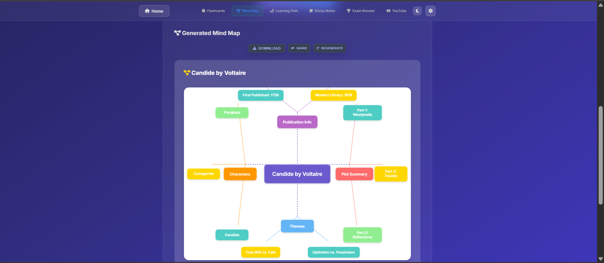

# StudyAI - The Ultimate AI-Powered Learning Platform

  
  <h3>Transform your study materials into interactive learning experiences</h3>


## 📚 Project Overview

StudyAI is a comprehensive AI-powered learning platform designed to revolutionize how students interact with educational content. By leveraging advanced AI technology, StudyAI transforms static study materials into dynamic, interactive learning resources that adapt to individual learning styles. It provides secure authentication, personal document storage, and collaborative study group features, making it a complete learning ecosystem.

## 🔍 Problem Statement: Open Innovation in Education

The educational technology landscape faces a critical challenge: despite the abundance of digital learning tools, there remains a significant gap in solutions that can transform passive content consumption into active, personalized learning experiences. Existing tools often lack personalization, interactivity, and a unified approach to different content formats. This project addresses the need for open innovation by creating an integrated platform that empowers students to build their own learning pathways from any source material.

## 💡 Our Solution

StudyAI addresses these challenges through open innovation by:

1.  **Content Transformation:** Converting static educational materials (PDFs, videos, text) into a suite of interactive learning experiences.
2.  **Multi-modal Learning:** Supporting various learning styles through diverse content formats like flashcards, mind maps, and summaries, all generated from a single source.
3.  **Unified Platform:** Providing a complete suite of AI-powered study tools in one application, eliminating the need for multiple, disconnected services.
4.  **Secure & Collaborative:** Provides secure user authentication via Google and enables collaborative learning through study groups where documents and AI-generated materials can be shared and saved.
5.  **Accessibility:** Making advanced AI learning technology available to all students regardless of their technical background, fostering a more inclusive educational environment.

## ✨ Key Features

-   **🔐 Secure Authentication & User Accounts**: Login securely with your Google account to save your documents, track your generated content, and manage your learning materials across sessions.
-   **👥 Collaborative Study Groups**: Create or join study groups to share documents with peers. All AI-generated content (flashcards, quizzes, etc.) is automatically saved and shared within the group, fostering a collaborative learning environment.
-   **🧠 Smart Flashcards Generator**: AI-powered flashcards with adaptive difficulty levels.
-   **🗺️ Interactive Mind Map Creator**: Visualize complex topics with auto-generated mind maps.
-   **🚀 Personalized Learning Path**: Step-by-step guides tailored to your materials.
-   **📝 Smart Sticky Notes**: Color-coded notes organized by importance.
-   **🏆 Exam Booster**: Practice questions with probability scores for exam likelihood.
-   **📺 YouTube Summarizer**: Convert videos into comprehensive text summaries.
-   **💬 Document Q&A Chat**: Have interactive conversations about your uploaded documents.

## 🔧 Project Structure

```
study_ai_complete/
├── main.py                   # FastAPI main application, handles routing
├── run.py                    # Application startup script (Uvicorn)
├── functions.py              # Core AI generation logic for most features
├── youtubefunctions.py       # Functions for YouTube video processing
├── doc_qna_routes.py         # API routes for the Document Q&A feature
├── function_for_DOC_QNA.py   # Backend logic for Document Q&A
├── database.py               # SQLAlchemy models and database session setup
├── auth.py                   # Google OAuth authentication and user management
├── init_db.py                # Script to initialize the database schema
├── static/                   # Frontend static assets
│   ├── css/
│   │   ├── style.css         # Main stylesheet for the homepage
│   │   └── feature-pages.css # Styles for individual feature pages
│   └── js/
│       ├── script.js         # Main JavaScript for homepage interactions
│       └── feature-pages.js  # JS for feature pages (upload, generation)
├── templates/                # Jinja2 HTML templates
│   ├── index.html            # Homepage
│   ├── flashcards.html       # Flashcards feature page
│   ├── mindmap.html          # Mind Map feature page
│   ├── learning-path.html    # Learning Path feature page
│   ├── sticky-notes.html     # Sticky Notes feature page
│   ├── exam-booster.html     # Exam Booster feature page
│   ├── youtube-summarizer.html # YouTube Summarizer page
│   ├── doc-chat.html         # Document Q&A chat interface
│   ├── groups.html           # Study Groups listing page
│   └── group-detail.html     # Page for a specific study group
└── whisper-main/             # OpenAI Whisper integration for audio transcription
```

## 🌟 What Makes StudyAI Different?

StudyAI isn’t just another AI assistant wrapped in a UI. It’s a complete **AI-native learning ecosystem**—designed to transform *your* materials into engaging, intelligent, and shareable study experiences. Here’s how it goes beyond the competition:

---

### ✅ 1. **Collaborative Learning, Not Just Solo Use**
> 💬 "Other AI tools help individuals. We built a system for teams."

With **built-in study groups**, users don’t just consume AI outputs—they **co-create, co-learn, and co-revise**.

🛠️ **How it works:**
- Every user can join or create a group via a **secure key**.
- Uploaded files and AI-generated outputs (flashcards, mind maps, quizzes) are auto-synced to the group.
- Group members view, update, and discuss content collaboratively.

---

### ✅ 2. **Persistence: Every Output Tied to Every Input**
> 🗂️ "Other tools generate and forget. We track everything."

Every document uploaded in StudyAI is associated with its **own persistent database record** of generated and ungenerated features.

🛠️ **How it works:**
- On upload, a **UserDocument** or **GroupDocument** is created.
- AI-generated content (e.g., flashcards, mind maps) is stored as `GeneratedFeature` rows in SQL.
- If a user revisits a document, we show them:
  - ✅ What’s already generated  
  - 🟡 What’s still available to generate  
  - 🔁 Option to regenerate and compare

📌 This persistence enables:
- Smart dashboards
- Regeneration history
- Feature completeness tracking per file

---

### ✅ 3. **From Raw Uploads to Rich Outputs — Seamlessly**
> 📚 "We don’t give you pre-built content. We transform your own files."

StudyAI accepts:
- 📄 PDFs / DOCX
- 🖼️ Images with text
- 🎙️ Audio (lectures)
- 📺 YouTube videos
- 🌐 Raw text or URLs

Every type is **parsed, cleaned, and chunked** using specialized handlers (e.g., `pdfplumber`, `EasyOCR`, `Whisper`, `LangChain` loaders) for precise downstream AI generation.

---

### ✅ 4. **Beyond Summaries: YouTube + AI for Real Learning**
> 📺 "Most tools stop at the transcript. We start there."

Our **YouTube pipeline** isn’t just about transcription:
- Extracts or transcribes content
- Summarizes intelligently
- Offers:
  - Flashcards
  - Sticky Notes
  - Exam Questions
  - Document Chat (over video!)

No other summarizer offers this breadth of **interactive tools** on top of YouTube content.

---

### ✅ 5. **Context-Rich Mind Maps with True Structure**
> 🗺️ "Other mind maps are just bubbles. Ours are blueprints."

StudyAI mind maps reflect actual **concept hierarchy and flow**, with:
- 🌐 Central and satellite node structure
- 🎨 Semantic coloring and dynamic scaling
- 📌 Interactive zoom/pan UI

We use vector embeddings + keyword clustering to **prioritize and connect topics** accurately.

---

### ✅ 6. **Conversational AI on Your Documents**
> 💬 "Ask your documents anything—literally."

We built a **retrieval-augmented chatbot** that:
- Searches document chunks (FAISS + BM25)
- Builds a Gemini prompt with only **high-relevance content**
- Returns accurate, grounded answers

Works across text, scanned notes, YouTube transcripts, and more.

---

### ✅ 7. **UI That Feels Built for Students**
> 🎨 "Not just JSON on a screen—this is crafted content."

Our frontend is **highly visual and interactive**, featuring:
- Flip-style flashcards 🎴
- Node-linked mind maps 🧠
- Probability-tagged exam questions 🧪
- Color-coded sticky notes 🟩🟨🟥
- Modal-based Q&A interfaces 💬
- Study group dashboards 👥

We chose **form AND function**—a UI that makes AI outputs not only understandable but engaging.

---

### ✅ 8. **Simple. Secure. Scalable.**
> 🔐 "OAuth + JWT + Cloudinary = zero barrier, full control."

From day one:
- Google OAuth2 for login
- JWT for token-based auth
- Role-based permissions (user/admin)
- Secure upload handling via Cloudinary

No unnecessary signups. No broken sessions. Just fast, safe access.

---

### 🧠 Summary

> **StudyAI is not a feature demo. It’s a fully integrated AI learning engine.**

| Trait | Why It Stands Out |
|------|--------------------|
| ✅ AI-first design | AI isn’t an add-on—it’s the core |
| 🧩 Modular system | From raw input to structured output |
| 📌 Persistent learning | Track all features per file |
| 🧠 Interactive UX | Crafted experience, not just responses |
| 👥 Group support | Real collaboration, not just chatbots |

## 🚀 Installation Guide

### Prerequisites
-   Python 3.8 or higher
-   pip (Python package installer)

### Setup Instructions

```bash
# 1. Clone the repository
git clone https://github.com/your-username/Study_AI_Complete_Project-master.git
cd Study_AI_Complete_Project-master

# 2. Set up a Python virtual environment (recommended)
python -m venv venv
# On Windows
venv\Scripts\activate
# On macOS/Linux
source venv/bin/activate

# 3. Install Whisper dependencies
cd whisper-main

pip install .

cd ..

# 4. Install all other required packages

pip install -r requirements.txt

# 5. Run the application

python run.py
```

The application will be available at `http://127.0.0.1:8000`.

## 💻 Usage Guide

1.  **Sign In**: Securely log in using your Google account to access your personal dashboard.
2.  **Upload or Join**: Upload your personal study documents or create/join a study group to collaborate on shared materials.
3.  **Generate Features**: For any document, select an AI tool (e.g., Flashcards, Mind Map) to generate interactive study aids.
4.  **Learn & Collaborate**: Your generated content is automatically saved and associated with the document. Access it anytime from your dashboard or view content generated by your group members.

## 📜 Originality & Attribution

In accordance with the principles of originality and attribution, this project credits all external libraries, APIs, and tools used.

### AI-Assisted Development
This project was developed with the assistance of AI programming tools, including GitHub Copilot. All AI-generated code has been reviewed, understood, and adapted by the developers to fit the project's specific implementation and requirements.

### External Libraries, Frameworks, and APIs
This project is built upon the following open-source libraries and external services.

**Backend & API:**
*   [FastAPI](https://fastapi.tiangolo.com/): High-performance web framework for building APIs.
*   [Uvicorn](https://www.uvicorn.org/): ASGI server for running FastAPI.
*   [Jinja2](https://jinja.palletsprojects.com/): Templating engine for rendering HTML.
*   [python-multipart](https://pypi.org/project/python-multipart/): For parsing multipart/form-data requests (file uploads).
*   [aiofiles](https://pypi.org/project/aiofiles/): For asynchronous file operations.

**AI & Machine Learning:**
*   [Google Generative AI (Gemini)](https://ai.google/discover/generativeai/): The core generative model for content creation.
*   [Langchain](https://www.langchain.com/): Framework for developing applications powered by language models.
*   [OpenAI Whisper](https://openai.com/research/whisper): For audio transcription (integrated via the `whisper-main` submodule).
*   [FAISS (faiss-cpu)](https://faiss.ai/): Library for efficient similarity search and clustering of dense vectors.
*   [Sentence-Transformers](https://www.sbert.net/): For creating state-of-the-art sentence and text embeddings.
*   [EasyOCR](https://github.com/JaidedAI/EasyOCR): Optical Character Recognition for extracting text from images.
*   [NumPy](https://numpy.org/): Fundamental package for scientific computing.
*   [Pandas](https://pandas.pydata.org/): Data analysis and manipulation tool.
*   [rank-bm25](https://pypi.org/project/rank-bm25/): For BM25 retrieval algorithm.

**Data & Document Processing:**
*   [PyPDF2](https://pypdf2.readthedocs.io/): A pure-python PDF library.
*   [python-docx](https://python-docx.readthedocs.io/): For creating and updating Microsoft Word (.docx) files.
*   [BeautifulSoup4](https://www.crummy.com/software/BeautifulSoup/): For pulling data out of HTML and XML files.
*   [pdfplumber](https://github.com/jsvine/pdfplumber): For extracting text and tables from PDF files.
*   [yt-dlp](https://github.com/yt-dlp/yt-dlp): A youtube-dl fork with additional features and fixes.
*   [youtube-transcript-api](https://github.com/jdepoix/youtube-transcript-api): For fetching YouTube video transcripts.
*   [Pillow](https://python-pillow.org/): The friendly PIL fork (Python Imaging Library).
*   [Playwright](https://playwright.dev/python/): For browser automation.

**Authentication & Security:**
*   [Google OAuth](https://developers.google.com/identity/protocols/oauth2) (implemented via [Authlib](https://authlib.org/)): For user authentication.
*   [python-jose](https://github.com/mpdavis/python-jose): For handling JWT, JWS, JWE, JWK, JWA.
*   [passlib[bcrypt]](https://passlib.readthedocs.io/): For password hashing.
*   [itsdangerous](https://itsdangerous.palletsprojects.com/): For signing data to ensure its integrity.

**Database & Storage:**
*   [SQLAlchemy](https://www.sqlalchemy.org/): The Python SQL Toolkit and Object Relational Mapper.
*   [Alembic](https://alembic.sqlalchemy.org/): A lightweight database migration tool for SQLAlchemy.
*   [Cloudinary](https://cloudinary.com/): Cloud-based image and video management service.

**Screen Shots:**





**Utilities:**
*   [python-dotenv](https://pypi.org/project/python-dotenv/): For managing environment variables.

## 📄 License

This project is licensed under the MIT License - see the `LICENSE` file for details.

---

<div align="center">
  <p>Made with ❤️ by the StudyAI Team</p>
</div>